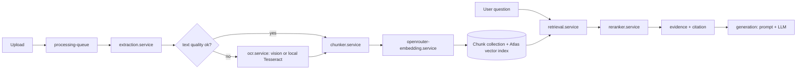

# RAG Pipeline

## Ingestion (`services/ingestion/`)
- `processing-queue.ts` bounds concurrency (`PROCESSING_CONCURRENCY`).
- `extraction.service.ts` + `extractors/` handle pdf, epub, docx, txt (`sourceFormat` on the book).
- `text-quality.service.ts` scores the PDF text layer; below `OCR_MIN_TEXT_SCORE` the page is re-rendered (`renderers/`) and sent to OCR; below `OCR_DROP_BELOW_SCORE` it is dropped.
- `chunker.service.ts` produces page-aware chunks; version stamped as `chunkingVersion` (`v2`).
- `pdf-storage.service.ts` / `placeholder-cover.service.ts` handle the stored source file and covers.

## OCR (`services/ocr/`)
`ocr.service.ts` dispatches to `vision-ocr.service.ts` (cloud model, `OCR_VISION_MODEL`) or `local-ocr.service.ts` (Tesseract, `OCR_LOCAL_LANGS`). Gated by `OCR_ENABLED` / `OCR_PROVIDER`.

## Retrieval (`services/retrieval/`)
- `retrieval.service.ts` — `$vectorSearch` over `Chunk.embedding`, filtered by the caller's [[Domain/Access Control|access scope]] (`allowedBookIdList`) and optionally one `bookId`. Candidate count is `topK × VECTOR_NUM_CANDIDATES_MULTIPLIER`, capped by `VECTOR_CANDIDATE_MAX`.
- An in-process LRU (256 entries) caches **query embeddings**, since embedding the question is a blocking network hop before any token streams.
- `reranker.service.ts` applies lexical reranking on `normalizedText`; `isLikelyTableOfContents` drops ToC noise (see `tests/toc.test.ts`).
- `evidence.service.ts` / `highlight.service.ts` / `citation.service.ts` build the page-cited evidence returned with each answer.
- `chat-retrieval.service.ts` and `quiz-retrieval.service.ts` are the two entry points.

## Generation (`services/generation/`)
`prompt.service.ts` builds the prompt, `llm-provider.service.ts` selects OpenRouter or a local OpenAI-compatible provider (`providers/`), `answer-parser.service.ts` + `citation.service.ts` turn the raw answer into cited output. `quiz.service.ts` reuses the same path for quizzes.

**Invariant:** the model only ever sees the question plus retrieved chunks — never whole books or the database.

Related: [[Architecture/Data Model]] · [[Operations/Environment]]
